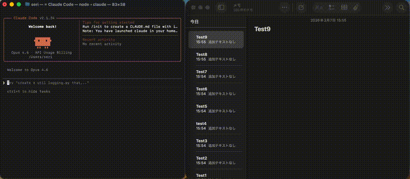

# claude-notes-app

[](https://opensource.org/licenses/MIT)
[](https://github.com/seri114/claude-notes-app/stargazers)

A Claude Code plugin for reading and writing macOS Notes.app using Python. Create, read, update, and delete notes with full Markdown support.



## Features

- **Create notes** from Markdown content
- **Read notes** and convert to Markdown
- **Update notes** by replacing content
- **Rename notes** while preserving content
- **Delete notes** by title
- **List notes** with optional pattern filtering
- **Markdown ↔ HTML conversion** for Notes.app compatibility
- **No external dependencies** - Uses Python standard library only

## Installation

### Recommended: via Marketplace

```bash
# Add the marketplace
claude plugin marketplace add seri114/claude-code

# Install the plugin
claude plugin install claude-notes-app
```

### Alternative: Manual Installation

```bash
# Clone the repository
git clone https://github.com/seri114/claude-notes-app.git ~/.claude/plugins/claude-notes-app

# Or add to your project-local plugins
git clone https://github.com/seri114/claude-notes-app.git .claude/plugins/claude-notes-app
```

## Requirements

- **macOS** with Notes.app
- **Python 3** (standard library only, no pip dependencies)
- **Claude Code** with plugin support

## Usage

The plugin provides a `/notes-app` skill that you can use directly in Claude Code.

### Examples

```
# Create a new note
/notes-app Create a note titled "Meeting Notes" with agenda items

# Read an existing note
/notes-app Show me the content of "Meeting Notes"

# Update a note
/notes-app Replace "Meeting Notes" with the updated agenda

# List all notes
/notes-app List all my notes

# List notes matching a pattern
/notes-app List notes containing "Project"

# Rename a note
/notes-app Rename "Old Title" to "New Title"

# Delete a note
/notes-app Delete "Old Notes"
```

### Direct Script Usage

You can also use the Python scripts directly:

```bash
# Create a note
echo "# Shopping List\n\n- Milk\n- Eggs\n- Bread" | \
  ~/.claude/plugins/claude-notes-app/skills/notes-app/scripts/create_note.py "Shopping List"

# Show a note
~/.claude/plugins/claude-notes-app/skills/notes-app/scripts/show_note.py "Shopping List"

# Replace note content
echo "# Updated Shopping List\n\n- Milk\n- Eggs\n- Bread\n- Butter" | \
  ~/.claude/plugins/claude-notes-app/skills/notes-app/scripts/replace_note.py "Shopping List"

# List notes
~/.claude/plugins/claude-notes-app/skills/notes-app/scripts/list_notes.py

# Delete a note
~/.claude/plugins/claude-notes-app/skills/notes-app/scripts/delete_note.py "Shopping List"
```

## Configuration

### Account and Folder

By default, notes are stored in your iCloud account > "Notes" folder. You can customize this:

```bash
export NOTES_ACCOUNT="On My Mac"
export NOTES_FOLDER="Custom Folder"
```

### Performance

Use the `LIMIT` environment variable to control how many notes are searched (default: 100):

```bash
LIMIT=500 ./scripts/show_note.py "Note Title"
```

## Markdown Support

The following Markdown syntax is supported:

| Syntax | Output |
|--------|--------|
| `# H1`, `## H2`, `### H3` | Headers |
| `**bold**`, `*italic*`, `***bolditalic***` | Emphasis |
| `~~strikethrough~~` | Strikethrough |
| `- item`, `1. item` | Lists |
| `[text](url)` | Links |
| `` `code` `` | Inline code |
| ```text``` | Code blocks |
| `\| A \| B \|` | Tables |
| `- [ ]`, `- [x]` | Checkboxes |
| `> quote` | Blockquotes |

### Known Limitations

These are limitations of Notes.app's internal HTML format, not this plugin:

- **Ordered lists**: Numbering is not preserved; all items become `1.`
- **Table separators**: `| --- | --- |` is optional and not stored
- **Single-word H3**: `### Word` looks like `**Word**` - use multi-word H3 headers
- **Links**: URLs in links may require special handling
- **Multi-line list items**: Continuation lines are not preserved
- **Code block indent**: Use ``` fences for code blocks

## Development

### Testing

The plugin includes a comprehensive test suite using pytest.

**Install pytest:**
```bash
pip install pytest
```

**Run tests:**
```bash
cd skills/notes-app
pytest scripts/test_all.py -v
```

**Run specific tests:**
```bash
# Run only converter tests
pytest scripts/test_all.py::TestConverter -v

# Run only E2E tests
pytest scripts/test_all.py::TestEndToEndRoundtrip -v

# Run tests matching a keyword
pytest scripts/test_all.py -k "code" -v
```

### Project Structure

```
claude-notes-app/
├── .claude-plugin/
│   └── plugin.json          # Plugin manifest
├── skills/
│   └── notes-app/
│       ├── SKILL.md         # Skill documentation
│       └── scripts/
│           ├── converter.py      # Markdown ↔ HTML converter
│           ├── utils.py          # AppleScript utilities
│           ├── create_note.py
│           ├── replace_note.py
│           ├── rename_note.py
│           ├── show_note.py
│           ├── delete_note.py
│           ├── list_notes.py
│           └── test_all.py       # Test suite
├── README.md
├── LICENSE
└── CHANGELOG.md
```

## License

MIT License - see [LICENSE](LICENSE) for details.

## Contributing

Contributions are welcome! Please see [CONTRIBUTING.md](CONTRIBUTING.md) for guidelines.

## Author

Created by [seri114](https://github.com/seri114)

---

**Keywords**: claude-code, claude-plugin, macos, notes-app, apple-notes, markdown, productivity, python
